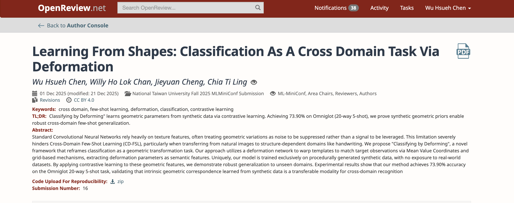
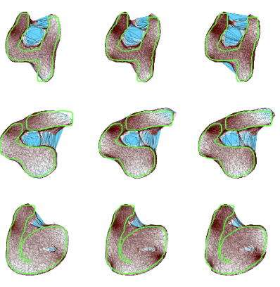
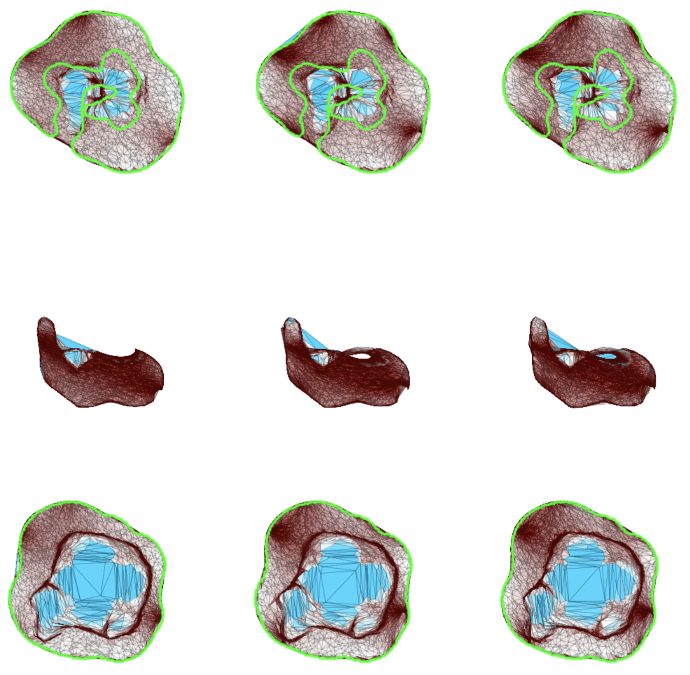
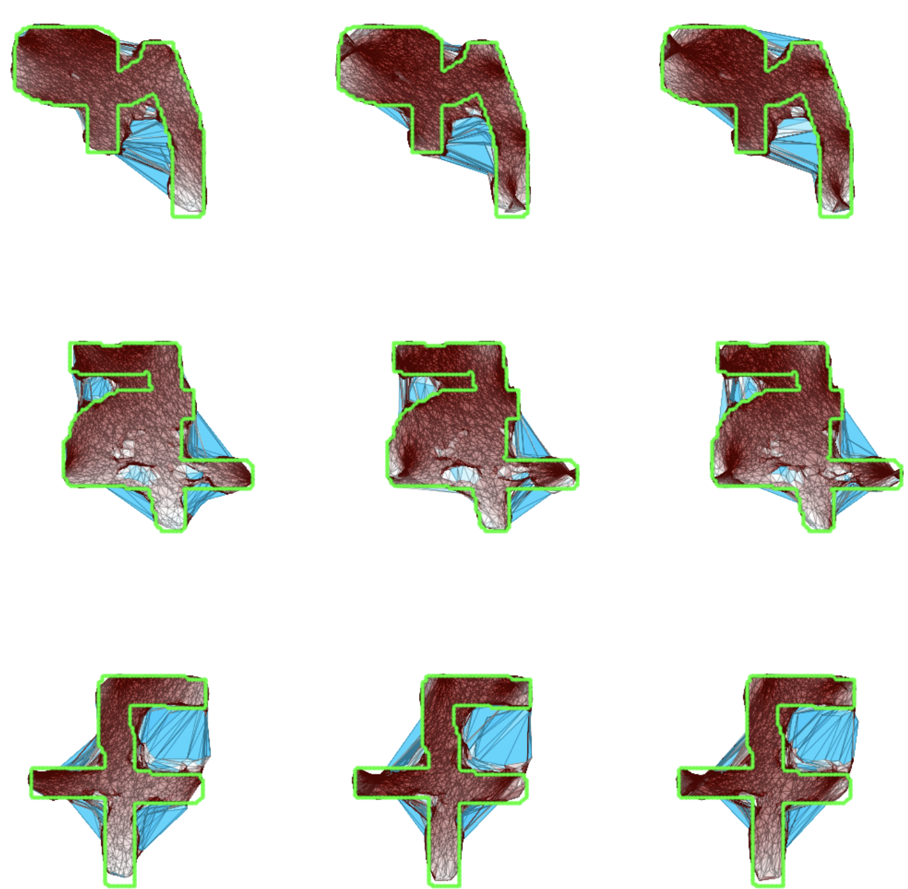

# Learning From Shapes: Classification As A Cross Domain Task Via Deformation

This repository is the official implementation of [Learning From Shapes: Classification As A Cross Domain Task Via Deformation](https://openreview.net/forum?id=6TZA3YCVHt&referrer=%5BAuthor+Console%5D%28%2Fgroup%3Fid%3Dntu.edu.tw%2FNational_Taiwan_University%2FFall_2025%2FML-MiniConf%2FAuthors%23your-submissions%29). 

> Note: Access to the official OpenReview link is restricted to registered participants of the NTU ML-MiniConf. If you do not have access, please refer to the full paper included in this repository: [`Learning_From_Shapes__Classification_As_A_Cross_Domain_Task_Via_Deformation.pdf`](./Learning_From_Shapes__Classification_As_A_Cross_Domain_Task_Via_Deformation.pdf).
> 
> Below is a screenshot of the official OpenReview submission record for verification:


## Requirements
1. Set up the environment
We recommend using a virtual environment to manage dependencies.

```bash
# Create a virtual environment
python -m venv .venv

# Activate the environment
# On Linux/macOS:
source .venv/bin/activate

# On Windows:
# .venv\Scripts\activate
```
2. Install dependencies
```bash
pip install -r requirements.txt
```

## Data Generation
This project contains two different data generation pipelines, corresponding to different components of the system.
### Synthetic dataset
To generate the synthetic dataset used for training the deformation network, run the following commands:
```bash
cd data_gen
bash ./generate_data.sh <number_of_batches> <output_directory>
```
Arguments:
- <number_of_batches>: The number of data batches to generate.
- <output_directory>: The target path where the dataset will be saved.

For the deformation metric module, data must be generated separately using the contrastive setup.
Run the following commands:
```bash
cd contrastive
bash ./scripts/gendata.sh
```

### Template
To generate our templates data, run the following command:
```bash
python data_gen/data_gen_src/template.py --template_dir /path/to/folder/saving_template --size <Image_resolution>
```

## Training
### Deformation Network
To train the model(s) in the paper, run this command:

1. Configuration \
    Before training, please modify the configuration file at configs/train_config.yaml.
- Important: Update the data_path to point to your generated dataset directory.
- You can also adjust other hyperparameters (e.g., learning rate, batch size) in this file.

2. Run Training

**Option A: Train Cage Deformation Network**
```bash
cd cage_deformation
python src/train.py
```

**Option B: Train Grid Deformation Network**

```bash
cd grid_deformation
python src/train.py
```

### Deformation Metric Module
Before training the models for the deformation metric module, make sure that the training and validation data have already been generated and are available under: `contrastive/data/`. Specifically, the directory should contain the prepared train and val datasets.

#### Training Command
To start training, run:
```bash
cd contrastive
bash ./scripts/train.sh
```

#### Training Different Models
You may modify the content of train.sh to train different variants of the deformation metric model. The following options correspond to three different training configurations:
```bash
# python src/grid_train.py --config grid
# python src/cage_train.py --config cage
python src/cage_wo_res_train.py --config cage_wo_res
```
Uncomment exactly one command depending on which model you want to train.


## Visualization
We provide a script to visualize the deformation effects of the **Cage-based model**. You can generate qualitative results on our synthetic dataset, MNIST, or Omniglot.

### Basic Usage

To run the visualization, use the following command:

```bash
python cage_deformation/src/test/model_vis.py --checkpoint-path <path_to_model> --output-dir <save_path> [options]
```

### Argument,Description:
```
--checkpoint-path: (Required) Path to the trained model weights. ⚠️ Note: This must be a cage-based model checkpoint.
--output-dir: Path to save the visualization results (default: images_eval).
--N: The number of samples to visualize (default: 8).
--show-cage: If set, the deformed cage grid will be visualized overlaid on the images.
--no-residual: If set, the model output will skip the residual flow, showing only the result of the Affine + Cage deformation.
--config-path: Path to the model configuration file (default: configs/train_config.yaml).
```

### Dataset Selection
You can choose which dataset to visualize using the following flags. If no dataset flag is provided, the script uses our Synthetic Dataset by default.
- (Default): Visualizes deformation on the Synthetic Dataset.

- `--mnist`: Visualizes deformation on the MNIST dataset.

- `--omniglot`: Visualizes deformation on the Omniglot dataset.

### Command Examples
1. Visualize Synthetic Data with Cage Overlay:
```bash
python  cage_deformation/src/test/model_vis.py \
  --checkpoint-path contrastive/checkpoint/new_stn.pth \
  --output-dir results/synthetic_vis \
  --show-cage
```

2. Visualize MNIST (Affine + Cage only):
```bash
python  cage_deformation/src/test/model_vis.py \
  --checkpoint-path contrastive/checkpoint/new_stn.pth \
  --output-dir results/mnist_vis \
  --mnist \
  --no-residual
```

3. Visualize Omniglot (16 samples):
```bash
python  cage_deformation/src/test/model_vis.py \
  --checkpoint-path contrastive/checkpoint/new_stn.pth \
  --output-dir results/omniglot_vis \
  --omniglot \
  --N 16
```

### Visualization Examples
Here, we present some visualization of our results.

<div align="center">
  <div style="display: flex; justify-content: space-between; width: 100%;">
    
    
    
  </div>
  <p align="center">Figure: Visualization Examples</p>
</div>


## Pre-trained Models
Run the following command to download all pretrained model for evaluating.
```bash
cd contrastive
bash ./scripts/download.sh
```

## Evaluation
Before running evaluation, make sure that you have downloaded the pretrained models by following the guideline above.

All required checkpoint files must exist in the correct locations.

To evaluate the model, run:
```bash
cd contrastive
bash ./scripts/valid.sh
```
This script loads the pretrained models and evaluates the deformation metric module on the validation data.

You can modify the content of `valid.sh` to evaluate different variants of the deformation metric module.
The following options are available:

```sh
#! /bin/bash

# python src/grid_valid.py --config grid
# python src/cage_valid.py --config cage
python src/cage_wo_res_valid.py --config cage_wo_res
```
- grid_valid.py: Evaluation for the grid-based model
- cage_valid.py: Evaluation for the cage-based model
- cage_wo_res_valid.py: Evaluation for the cage-based model without residual connections

Uncomment exactly one command depending on which model you want to evaluate.

## Results
### Image Classification on Omniglot (Few shot)
We evaluate the generalization capability of our model on the **Omniglot** dataset under standard Few-Shot Classification settings.

The table below compares our method (pre-trained on **synthetic data**) against relevant baselines.

| Method | Pre-training Data | 5-way 1-shot Acc. | 5-way 5-shot Acc. | 20-way 1-shot Acc. | 20-way 5-shot Acc. |
| :--- | :--- | :---: | :---: | :---: | :---: |
| **Ours (SSL Pre-training)** | **Synthetic (Ours)** | **86.33** | **95.89** | **70.61** | **86.22** |

> 📋 **Note on Benchmarking:** \
> Since this project explores a novel setting using **Synthetic Data for Self-Supervised Learning**, there is no direct public leaderboard available. \
> We compare our method against **models trained from scratch** and **models pre-trained on real data** to demonstrate that our synthetic data pipeline achieves cross domain few-shot classification performance without requiring real-world annotations.

## Contributing
### Citation
If you use this code for your research, please cite our papers.
```
@inproceedings{Deform2025Class,
  title={Learning From Shapes: Classification As A Cross Domain Task Via Deformation},
  author={Anonymous authors},
  year={2025}
}
```

### License
This project is under the MIT license. See [LICENSE](LICENSE) for details.
